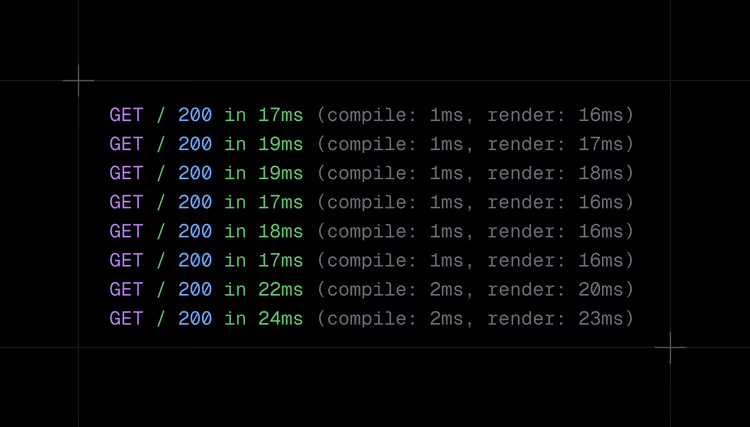

# Next.js 16 Release Notes

## Overview

This release provides the latest improvements to Turbopack, caching, and the
Next.js architecture.

### New Features Since Previous Beta

- **Cache Components**: New model using Partial Pre-Rendering (PPR) and
  `use cache` for instant navigation
- **Next.js Devtools MCP**: Model Context Protocol integration for improved
  debugging and workflow
- **Proxy**: Middleware replaced by `proxy.ts` to clarify network boundary
- **DX**: Improved logging for builds and development requests

### Features Available Since Previous Beta Release

- **Turbopack (stable)**: Default bundler for all apps with up to 5-10x faster
  Fast Refresh, and 2-5x faster builds
- **Turbopack File System Caching (beta)**: Even faster startup and compile
  times for the largest apps
- **React Compiler Support (stable)**: Built-in integration for automatic
  memoization
- **Build Adapters API (alpha)**: Create custom adapters to modify the build
  process
- **Enhanced Routing**: Optimized navigations and prefetching with layout
  deduplication and incremental prefetching
- **Improved Caching APIs**: New `updateTag()` and refined `revalidateTag()`
- **React 19.2**: View Transitions, `useEffectEvent()`, `<Activity/>`
- **Breaking Changes**: Async params, `next/image` defaults, and more

---

## New Features and Improvements

### Cache Components

Cache Components are a new set of features designed to make caching in Next.js
both more explicit and more flexible.

#### Key Concepts

- Centers around the new `"use cache"` directive
- Can be used to cache pages, components, and functions
- Leverages the compiler to automatically generate cache keys
- Entirely opt-in (unlike implicit caching in previous App Router versions)
- All dynamic code in any page, layout, or API route is executed at request time
  by default

#### Relationship with Partial Prerendering (PPR)

Cache Components complete the story of Partial Prerendering (PPR), which was
first introduced in 2023:

- **Before PPR**: Next.js had to choose whether to render each URL statically or
  dynamically (no middle ground)
- **With PPR**: Developers can opt portions of static pages into dynamic
  rendering (via Suspense) without sacrificing fast initial load

#### Configuration

Enable Cache Components in `next.config.ts`:

```typescript
const nextConfig = {
  cacheComponents: true
}

export default nextConfig
```

#### Important Notes

- More information will be shared at Next.js Conf 2025 on October 22nd
- Additional content coming in blog and documentation in the coming weeks
- The previous experimental `experimental.ppr` flag and configuration options
  have been removed in favor of the Cache Components configuration

#### Documentation

Learn more in the [documentation](link).

---

### Next.js Devtools MCP

Next.js 16 introduces Next.js DevTools MCP, a Model Context Protocol integration
for AI-assisted debugging with contextual insight into your application.

#### Features Provided to AI Agents

- **Next.js knowledge**: Routing, caching, and rendering behavior
- **Unified logs**: Browser and server logs without switching contexts
- **Automatic error access**: Detailed stack traces without manual copying
- **Page awareness**: Contextual understanding of the active route

#### Benefits

Enables AI agents to diagnose issues, explain behavior, and suggest fixes
directly within your development workflow.

#### Documentation

Learn more in the [documentation](link).

---

### proxy.ts (formerly middleware.ts)

`proxy.ts` replaces `middleware.ts` and makes the app's network boundary
explicit. `proxy.ts` runs on the Node.js runtime.

#### Migration Steps

- **What to do**: Rename `middleware.ts` → `proxy.ts` and rename the exported
  function to `proxy`. Logic stays the same.
- **Why**: Clearer naming and a single, predictable runtime for request
  interception.

#### Example

```typescript
// proxy.ts
export default function proxy(request: NextRequest) {
  return NextResponse.redirect(new URL('/home', request.url))
}
```

#### Important Notes

- The `middleware.ts` file is still available for Edge runtime use cases
- `middleware.ts` is deprecated and will be removed in a future version

#### Documentation

Learn more in the [documentation](link).

---

### Logging Improvements

In Next.js 16, the development request logs are extended showing where time is
spent:

- **Compile**: Routing and compilation
- **Render**: Running your code and React rendering



#### Build Logging

The build is also extended to show where time is spent. Each step in the build
process is now shown with the time it took to complete.

```terminal
     ▲ Next.js 16 (Turbopack)

 ✓ Compiled successfully in 615ms
 ✓ Finished TypeScript in 1114ms
 ✓ Collecting page data in 208ms
 ✓ Generating static pages in 239ms
 ✓ Finalizing page optimization in 5ms
```

---

## Developer Experience

### Turbopack (stable)

Turbopack has reached stability for both development and production builds, and
is now the default bundler for all new Next.js projects.

#### Adoption Statistics

Since its beta release earlier this summer, adoption has scaled rapidly:

- More than 50% of development sessions on Next.js 15.3+ are running on
  Turbopack
- 20% of production builds on Next.js 15.3+ are running on Turbopack

#### Performance Benefits

- 2–5× faster production builds
- Up to 10× faster Fast Refresh

#### Webpack Support

For apps with custom webpack setups, you can continue using webpack by running:

```terminal
next dev --webpack
next build --webpack
```

---

### Turbopack File System Caching (beta)

Turbopack now supports filesystem caching in development, storing compiler
artifacts on disk between runs for significantly faster compile times across
restarts, especially in large projects.

#### Configuration

Enable filesystem caching in your configuration:

```typescript
// next.config.ts
const nextConfig = {
  experimental: {
    turbopackFileSystemCacheForDev: true
  }
}

export default nextConfig
```

#### Usage and Feedback

- All internal Vercel apps are already using this feature
- Notable improvements in developer productivity across large repositories
- Feedback is welcome as the feature is iterated on

---

### Simplified create-next-app

`create-next-app` has been redesigned with:

- Simplified setup flow
- Updated project structure
- Improved defaults

#### New Template Includes

- App Router by default
- TypeScript-first configuration
- Tailwind CSS
- ESLint

---

### Build Adapters API (alpha)

Following the Build Adapters RFC, the first alpha version of the Build Adapters
API has been delivered.

#### Purpose

Build Adapters allow you to create custom adapters that hook into the build
process, enabling:

- Deployment platforms to modify Next.js configuration
- Custom build integrations to process build output

#### Configuration

```javascript
// next.config.js
const nextConfig = {
  experimental: {
    adapterPath: require.resolve('./my-adapter.js')
  }
}

module.exports = nextConfig
```

#### Feedback

Share your feedback in the RFC discussion.

---

### React Compiler Support (stable)

Built-in support for the React Compiler is now stable in Next.js 16 following
the React Compiler's 1.0 release.

#### What It Does

The React Compiler automatically memoizes components, reducing unnecessary
re-renders with zero manual code changes.

#### Configuration Status

- The `reactCompiler` configuration option has been promoted from experimental
  to stable
- Not enabled by default as build performance data is gathered across different
  application types
- Compile times in development and during builds will be higher when enabling
  this option (React Compiler relies on Babel)

#### Configuration

```typescript
// next.config.ts
const nextConfig = {
  reactCompiler: true
}

export default nextConfig
```

#### Installation

Install the latest version of the React Compiler plugin:

```terminal
npm install babel-plugin-react-compiler@latest
```

---

## Core Features & Architecture

### Enhanced Routing and Navigation

Next.js 16 includes a complete overhaul of the routing and navigation system,
making page transitions leaner and faster.

#### Layout Deduplication

When prefetching multiple URLs with a shared layout, the layout is downloaded
once instead of separately for each Link.

**Example**: A page with 50 product links now downloads the shared layout once
instead of 50 times, dramatically reducing the network transfer size.

#### Incremental Prefetching

Next.js only prefetches parts not already in cache, rather than entire pages.

**The prefetch cache now:**

- Cancels requests when the link leaves the viewport
- Prioritizes link prefetching on hover or when re-entering the viewport
- Re-prefetches links when their data is invalidated
- Works seamlessly with upcoming features like Cache Components

#### Trade-offs

- You may see more individual prefetch requests, but with much lower total
  transfer sizes
- This is believed to be the right trade-off for nearly all applications
- If the increased request count causes issues, feedback is welcome
- Additional optimizations to inline data chunks more efficiently are being
  worked on

#### Migration

These changes require no code modifications and are designed to improve
performance across all apps.

---

### Improved Caching APIs

Next.js 16 introduces refined caching APIs for more explicit control over cache
behavior.

#### revalidateTag() (updated)

`revalidateTag()` now requires a `cacheLife` profile as the second argument to
enable stale-while-revalidate (SWR) behavior.

**Syntax:**

```javascript
import { revalidateTag } from 'next/cache'

// ✅ Use built-in cacheLife profile (we recommend 'max' for most cases)
revalidateTag('blog-posts', 'max')

// Or use other built-in profiles
revalidateTag('news-feed', 'hours')
revalidateTag('analytics', 'days')

// Or use an inline object with a custom revalidation time
revalidateTag('products', { revalidate: 3600 })

// ⚠️ Deprecated - single argument form
revalidateTag('blog-posts')
```

**Profile Argument:**

- Accepts built-in `cacheLife` profile names (like `'max'`, `'hours'`, `'days'`)
- Or custom profiles defined in your `next.config`
- Or an inline `{ expire: number }` object
- We recommend using `'max'` for most cases, as it enables background
  revalidation for long-lived content

**Behavior:**

When users request tagged content, they receive cached data immediately while
Next.js revalidates in the background.

**Use Case:**

Use `revalidateTag()` when you want to invalidate only properly tagged cached
entries with stale-while-revalidate behavior. This is ideal for static content
that can tolerate eventual consistency.

**Migration Guidance:**

Add the second argument with a `cacheLife` profile (we recommend `'max'`) for
SWR behavior, or use `updateTag()` in Server Actions if you need
read-your-writes semantics.

---

#### updateTag() (new)

`updateTag()` is a new Server Actions-only API that provides read-your-writes
semantics, expiring and immediately reading fresh data within the same request.

**Example:**

```javascript
'use server';

import { updateTag } from 'next/cache';

export async function updateUserProfile(userId: string, profile: Profile) {
    await db.users.update(userId, profile);

    // Expire cache and refresh immediately - user sees their changes right away
    updateTag(`user-${userId}`);
}
```

**Use Case:**

This ensures interactive features reflect changes immediately. Perfect for
forms, user settings, and any workflow where users expect to see their updates
instantly.

---

#### refresh() (new)

`refresh()` is a new Server Actions-only API for refreshing uncached data only.
It doesn't touch the cache at all.

**Example:**

```javascript
'use server';

import { refresh } from 'next/cache';

export async function markNotificationAsRead(notificationId: string) {
    // Update the notification in the database
    await db.notifications.markAsRead(notificationId);

    // Refresh the notification count displayed in the header
    // (which is fetched separately and not cached)
    refresh();
}
```

**Use Case:**

This API is complementary to the client-side `router.refresh()`. Use it when you
need to refresh uncached data displayed elsewhere on the page after performing
an action. Your cached page shells and static content remain fast while dynamic
data like notification counts, live metrics, or status indicators refresh.

---

### React 19.2 and Canary Features

The App Router in Next.js 16 uses the latest React Canary release, which
includes the newly released React 19.2 features and other features being
incrementally stabilized.

#### Highlights

- **View Transitions**: Animate elements that update inside a Transition or
  navigation
- **useEffectEvent**: Extract non-reactive logic from Effects into reusable
  Effect Event functions
- **Activity**: Render "background activity" by hiding UI with `display: none`
  while maintaining state and cleaning up Effects

---

## Breaking Changes and Other Updates

### Version Requirements

| Change            | Details                                                          |
| ----------------- | ---------------------------------------------------------------- |
| **Node.js 20.9+** | Minimum version now 20.9.0 (LTS); Node.js 18 no longer supported |
| **TypeScript 5+** | Minimum version now 5.1.0                                        |
| **Browsers**      | Chrome 111+, Edge 111+, Firefox 111+, Safari 16.4+               |

---

### Removals

These features were previously deprecated and are now removed:

| Removed                                           | Replacement                                                                                                                                     |
| ------------------------------------------------- | ----------------------------------------------------------------------------------------------------------------------------------------------- |
| **AMP support**                                   | All AMP APIs and configs removed (`useAmp`, `export const config = { amp: true }`)                                                              |
| **next lint command**                             | Use Biome or ESLint directly; `next build` no longer runs linting. A codemod is available: `npx @next/codemod@canary next-lint-to-eslint-cli .` |
| **devIndicators options**                         | `appIsrStatus`, `buildActivity`, `buildActivityPosition` removed from config. The indicator remains.                                            |
| **serverRuntimeConfig, publicRuntimeConfig**      | Use environment variables (`.env` files)                                                                                                        |
| **experimental.turbopack location**               | Config moved to top-level `turbopack` (no longer in `experimental`)                                                                             |
| **experimental.dynamicIO flag**                   | Renamed to `cacheComponents`                                                                                                                    |
| **experimental.ppr flag**                         | PPR flag removed; evolving into Cache Components programming model                                                                              |
| **export const experimental_ppr**                 | Route-level PPR export removed; evolving into Cache Components programming model                                                                |
| **Automatic scroll-behavior: smooth**             | Add `data-scroll-behavior="smooth"` to HTML document to opt back in                                                                             |
| **unstable_rootParams()**                         | An alternative API is being worked on that will ship in an upcoming minor                                                                       |
| **Sync params, searchParams props access**        | Must use async: `await params`, `await searchParams`                                                                                            |
| **Sync cookies(), headers(), draftMode() access** | Must use async: `await cookies()`, `await headers()`, `await draftMode()`                                                                       |
| **Metadata image route params argument**          | Changed to async params; `id` from `generateImageMetadata` now `Promise<string>`                                                                |
| **next/image local src with query strings**       | Now requires `images.localPatterns` config to prevent enumeration attacks                                                                       |

---

### Behavior Changes

These features have new default behaviors in Next.js 16:

| Changed Behavior                     | Details                                                                                                                                                                         |
| ------------------------------------ | ------------------------------------------------------------------------------------------------------------------------------------------------------------------------------- |
| **Default bundler**                  | Turbopack is now the default bundler for all apps; opt out with `next build --webpack`                                                                                          |
| **images.minimumCacheTTL default**   | Changed from 60s to 4 hours (14400s); reduces revalidation cost for images without cache-control headers                                                                        |
| **images.imageSizes default**        | Removed 16 from default sizes (used by only 4.2% of projects); reduces srcset size and API variations                                                                           |
| **images.qualities default**         | Changed from [1..100] to [75]; quality prop is now coerced to closest value in `images.qualities`                                                                               |
| **images.dangerouslyAllowLocalIP**   | New security restriction blocks local IP optimization by default; set to `true` for private networks only                                                                       |
| **images.maximumRedirects default**  | Changed from unlimited to 3 redirects maximum; set to 0 to disable or increase for rare edge cases                                                                              |
| **@next/eslint-plugin-next default** | Now defaults to ESLint Flat Config format, aligning with ESLint v10 which will drop legacy config support                                                                       |
| **Prefetch cache behavior**          | Complete rewrite with layout deduplication and incremental prefetching                                                                                                          |
| **revalidateTag() signature**        | Now requires `cacheLife` profile as second argument for stale-while-revalidate behavior                                                                                         |
| **Babel configuration in Turbopack** | Automatically enables Babel if a babel config is found (previously exited with hard error)                                                                                      |
| **Terminal output**                  | Redesigned with clearer formatting, better error messages, and improved performance metrics                                                                                     |
| **Dev and build output directories** | `next dev` and `next build` now use separate output directories, enabling concurrent execution                                                                                  |
| **Lockfile behavior**                | Added lockfile mechanism to prevent multiple `next dev` or `next build` instances on the same project                                                                           |
| **Parallel routes default.js**       | All parallel route slots now require explicit `default.js` files; builds fail without them. Create `default.js` that calls `notFound()` or returns `null` for previous behavior |
| **Modern Sass API**                  | Bumped `sass-loader` to v16, which supports modern Sass syntax and new features                                                                                                 |

---

### Deprecations

These features are deprecated in Next.js 16 and will be removed in a future
version:

| Deprecated                          | Details                                                                                        |
| ----------------------------------- | ---------------------------------------------------------------------------------------------- |
| **middleware.ts filename**          | Rename to `proxy.ts` to clarify network boundary and routing focus                             |
| **next/legacy/image component**     | Use `next/image` instead for improved performance and features                                 |
| **images.domains config**           | Use `images.remotePatterns` config instead for improved security restriction                   |
| **revalidateTag() single argument** | Use `revalidateTag(tag, profile)` for SWR, or `updateTag(tag)` in Actions for read-your-writes |

---

## Additional Improvements

- **Performance improvements**: Significant performance optimizations for
  `next dev` and `next start` commands
- **Node.js native TypeScript for next.config.ts**: Run `next dev`,
  `next build`, and `next start` commands with
  `--experimental-next-config-strip-types` flag to enable native TypeScript for
  `next.config.ts`.

---

## Migration Guide

A more comprehensive migration guide will be shared ahead of the stable release
in the documentation.
