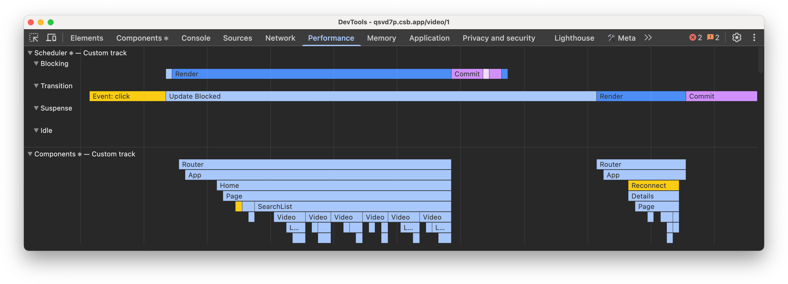

# React 19.2

**Release Date:** October 1, 2025  
**Author:** The React Team  
**Availability:** npm

---

## Overview

React 19.2 is the third release in the last year, following:

- React 19 (December)
- React 19.1 (June)

This document outlines new features and notable changes in React 19.2.

---

## Table of Contents

### New React Features

- [`<Activity />`](#activity-component)
- [`useEffectEvent`](#useeffectevent)
- [`cacheSignal`](#cachesignal)
- [Performance Tracks](#performance-tracks)

### New React DOM Features

- [Partial Pre-rendering](#partial-pre-rendering)

### Notable Changes

- [Batching Suspense Boundaries for SSR](#batching-suspense-boundaries-for-ssr)
- [SSR: Web Streams support for Node](#ssr-web-streams-support-for-node)
- [eslint-plugin-react-hooks v6](#eslint-plugin-react-hooks-v6)
- [Update the default useId prefix](#update-the-default-useid-prefix)

### Additional Information

- [Changelog](#changelog)

---

## New React Features

### `<Activity />` Component

**Purpose:** Break your app into "activities" that can be controlled and
prioritized.

#### Usage Pattern

```jsx
// Before
{
  isVisible && <Page />
}

// After
;<Activity mode={isVisible ? 'visible' : 'hidden'}>
  <Page />
</Activity>
```

#### Supported Modes

| Mode      | Behavior                                                                       |
| --------- | ------------------------------------------------------------------------------ |
| `hidden`  | Hides children, unmounts effects, defers updates until React has no other work |
| `visible` | Shows children, mounts effects, processes updates normally                     |

#### Key Benefits

- Pre-render and keep rendering hidden parts without impacting visible content
  performance
- Pre-load content users are likely to navigate to next
- Save state of parts users navigate away from
- Faster navigation by loading data, CSS, and images in background
- Maintain state (e.g., input fields) during back navigation

#### Future Plans

Additional modes for different use cases will be added.

**Documentation:** [Activity docs](https://react.dev/reference/react/Activity)

---

### `useEffectEvent`

**Purpose:** Extract "event" logic from Effects to prevent unnecessary re-runs
when non-critical dependencies change.

#### Problem Statement

Effects re-run when any dependency changes, even if that dependency isn't
related to the Effect's core logic.

#### Before

```jsx
function ChatRoom({ roomId, theme }) {
  useEffect(() => {
    const connection = createConnection(serverUrl, roomId)
    connection.on('connected', () => {
      showNotification('Connected!', theme)
    })
    connection.connect()
    return () => {
      connection.disconnect()
    }
  }, [roomId, theme]) // Theme change causes reconnection
  // ...
}
```

**Problem:** Changing `theme` causes chat room reconnection.

#### After

```jsx
function ChatRoom({ roomId, theme }) {
  const onConnected = useEffectEvent(() => {
    showNotification('Connected!', theme)
  })

  useEffect(() => {
    const connection = createConnection(serverUrl, roomId)
    connection.on('connected', () => {
      onConnected()
    })
    connection.connect()
    return () => connection.disconnect()
  }, [roomId]) // ✅ All dependencies declared (Effect Events aren't dependencies)
  // ...
}
```

#### Key Characteristics

- Effect Events always see the latest props and state (similar to DOM events)
- Should NOT be declared in dependency arrays
- Requires `eslint-plugin-react-hooks@latest` for proper linting
- Must be declared in same component or Hook as their Effect (linter-verified)

#### When to Use

**Use `useEffectEvent` for:**

- Functions that are conceptually "events" fired from an Effect (not user
  events)

**Do NOT use for:**

- Silencing lint errors without conceptual justification (can lead to bugs)
- Wrapping everything unnecessarily

**Further Reading:**
[Separating Events from Effects](https://react.dev/learn/separating-events-from-effects)

---

### `cacheSignal`

**Scope:** React Server Components only

**Purpose:** Know when the `cache()` lifetime is over.

#### Usage

```jsx
import { cache, cacheSignal } from 'react'
const dedupedFetch = cache(fetch)

async function Component() {
  await dedupedFetch(url, { signal: cacheSignal() })
}
```

#### Use Cases

Clean up or abort work when cached results are no longer needed:

- React successfully completed rendering
- Render was aborted
- Render failed

**Documentation:**
[cacheSignal docs](https://react.dev/reference/react/cacheSignal)

---

### Performance Tracks

**New feature:** Custom tracks in Chrome DevTools performance profiles for React
apps.



#### Available Tracks

##### 1. Scheduler ⚛

**Shows:**

- What React is working on at different priorities:
  - "blocking" for user interactions
  - "transition" for updates inside `startTransition`
- Type of work being performed
- Event that scheduled an update
- When render for that update happened
- When updates are blocked waiting for different priorities
- When React is waiting for paint before continuing

**Purpose:** Understand how React splits code into priorities and execution
order.

**Documentation:**
[Scheduler track docs](https://react.dev/learn/react-developer-tools#scheduler-track)

##### 2. Components ⚛

**Shows:**

- Component tree React is working on
- Labels indicating state:
  - "Mount" for when children/effects mount
  - "Blocked" for when rendering is blocked due to yielding
- Time to complete work

**Purpose:** Identify when components render or run effects and diagnose
performance problems.

**Documentation:**
[Components track docs](https://react.dev/learn/react-developer-tools#components-track)

---

## New React DOM Features

### Partial Pre-rendering

**Purpose:** Pre-render part of the app ahead of time and resume rendering
later.

#### Workflow

##### Step 1: Pre-render with AbortController

```jsx
const { prelude, postponed } = await prerender(<App />, {
  signal: controller.signal
})

// Save the postponed state for later
await savePostponedState(postponed)

// Send prelude to client or CDN.
```

##### Step 2: Resume Rendering

**Option A: Resume to SSR Stream**

```jsx
const postponed = await getPostponedState(request)
const resumeStream = await resume(<App />, postponed)

// Send stream to client.
```

**Option B: Resume to Static HTML (SSG)**

```jsx
const postponedState = await getPostponedState(request)
const { prelude } = await resumeAndPrerender(<App />, postponedState)

// Send complete HTML prelude to CDN.
```

#### New APIs

##### `react-dom/server`

- `resume` - for Web Streams
- `resumeToPipeableStream` - for Node Streams

##### `react-dom/static`

- `resumeAndPrerender` - for Web Streams
- `resumeAndPrerenderToNodeStream` - for Node Streams

**Note:** `prerender` APIs now return a `postpone` state to pass to resume APIs.

---

## Notable Changes

### Batching Suspense Boundaries for SSR

**Change:** Fixed behavioral bug where Suspense boundaries revealed differently
between client and SSR.

#### New Behavior (React 19.2+)

React batches reveals of server-rendered Suspense boundaries for a short time
to:

- Allow more content to be revealed together
- Align with client-rendered behavior

#### Visual Comparison

**Previous Behavior:**

```
[Loading State] → [Immediate Partial Reveal] → [Complete Reveal]
```

**New Behavior:**

```
[Loading State] → [Batched Wait] → [More Complete Reveal]
```

#### Benefits

- Prepares apps for `<ViewTransition>` support during SSR
- Animations run in larger batches
- Avoids chaining animations for content streaming in close together

#### Performance Safeguards

React uses heuristics to ensure batching doesn't impact:

- Core Web Vitals
- Search ranking

**Example:** If total page load time approaches 2.5s (LCP "good" threshold),
React stops batching and reveals content immediately.

---

### SSR: Web Streams support for Node

**New in React 19.2:** Web Streams support for streaming SSR in Node.js.

#### Available APIs for Node.js

**Rendering:**

- `renderToReadableStream`
- `prerender`

**Resuming:**

- `resume`
- `resumeAndPrerender`

#### ⚠️ Important Recommendation

**Prefer Node Streams for Node.js environments:**

**Recommended Node Streams APIs:**

- `renderToPipeableStream`
- `resumeToPipeableStream`
- `prerenderToNodeStream`
- `resumeAndPrerenderToNodeStream`

**Reasons:**

- Node Streams are much faster than Web Streams in Node.js
- Web Streams don't support compression by default
- Missing compression leads to lost streaming benefits

---

### eslint-plugin-react-hooks v6

**Published:** `eslint-plugin-react-hooks@latest`

#### Changes

- Flat config by default in recommended preset
- Opt-in for new React Compiler powered rules

#### Migration for Legacy Config

```diff
- extends: ['plugin:react-hooks/recommended']
+ extends: ['plugin:react-hooks/recommended-legacy']
```

**Documentation:**

- [Compiler-enabled rules](https://react.dev/learn/react-compiler#linting)
- [Full changelog](https://github.com/facebook/react/blob/main/packages/eslint-plugin-react-hooks/CHANGELOG.md)

---

### Update the default useId prefix

**Change:** Default `useId` prefix updated in React 19.2.

#### Version History

| Version | Prefix |
| ------- | ------ |
| 19.0.0  | `:r:`  |
| 19.1.0  | `«r»`  |
| 19.2.0  | `_r_`  |

#### Rationale

**Original intent:** Use special characters invalid for CSS selectors to avoid
ID collisions.

**New requirement:** Support View Transitions, requiring IDs that are valid for:

- `view-transition-name`
- XML 1.0 names

---

## Changelog

### Other Notable Changes

- **react-dom:** Allow nonce to be used on hoistable styles
  [#32461](https://github.com/facebook/react/pull/32461)
- **react-dom:** Warn for using a React owned node as a Container if it also has
  text content [#32774](https://github.com/facebook/react/pull/32774)

### Notable Bug Fixes

#### React Core

- Stringify context as "SomeContext" instead of "SomeContext.Provider"
  [#33507](https://github.com/facebook/react/pull/33507)
- Fix infinite `useDeferredValue` loop in popstate event
  [#32821](https://github.com/facebook/react/pull/32821)
- Fix a bug when an initial value was passed to `useDeferredValue`
  [#34376](https://github.com/facebook/react/pull/34376)
- Fix a crash when submitting forms with Client Actions
  [#33055](https://github.com/facebook/react/pull/33055)
- Hide/unhide the content of dehydrated suspense boundaries if they resuspend
  [#32900](https://github.com/facebook/react/pull/32900)
- Avoid stack overflow on wide trees during Hot Reload
  [#34145](https://github.com/facebook/react/pull/34145)
- Improve component stacks in various places
  [#33629](https://github.com/facebook/react/pull/33629),
  [#33724](https://github.com/facebook/react/pull/33724),
  [#32735](https://github.com/facebook/react/pull/32735),
  [#33723](https://github.com/facebook/react/pull/33723)
- Fix a bug with `React.use` inside `React.lazy`-ed Component
  [#33941](https://github.com/facebook/react/pull/33941)

#### React DOM

- Stop warning when ARIA 1.3 attributes are used
  [#34264](https://github.com/facebook/react/pull/34264)
- Fix a bug with deeply nested Suspense inside Suspense fallbacks
  [#33467](https://github.com/facebook/react/pull/33467)
- Avoid hanging when suspending after aborting while rendering
  [#34192](https://github.com/facebook/react/pull/34192)
