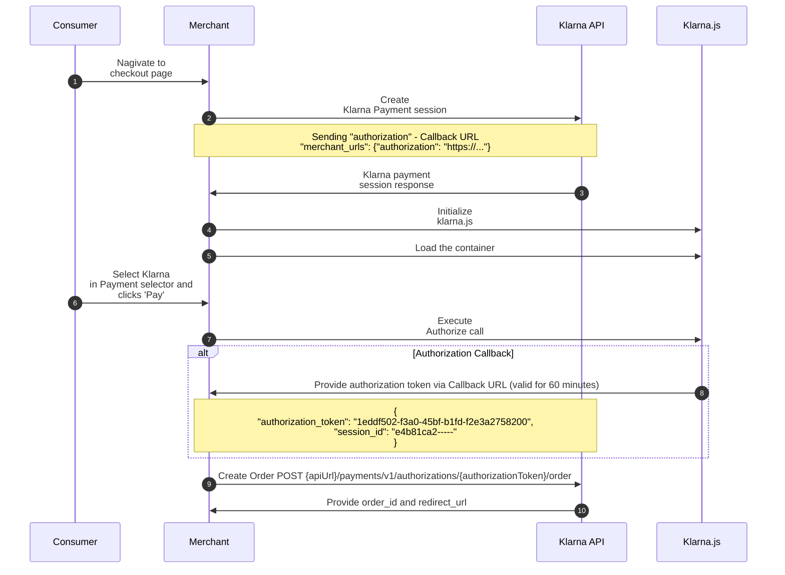

# Activating callbacks

To ensure optimization of the conversion rates, you should get an authorization token through a server-side
callback.

When Klarna approves a customer, [you receive an authorization token](#get-authorization) that lets you place
an order. While you would typically receive `authorization_token` as a response to the `authorize()` call, you
are required to implement the server-side callback to a specific URL to receive the `authorization_token` and
`session_id` in the backend.

By using server-side authorization callback, you can create an order in case of any client-side communication
issues.

Payment methods that require complex customer interactions, for example switching between banking apps, are
vulnerable to front-end communication issues. If communication breaks down, a valid authorization_token issued
by Klarna payments may not reach the client, making placing an order impossible.

This can lead to the customer being charged without the payment getting registered in your checkout. Such
errors can affect your store's conversion rates if the customer believes they have completed an order but
don't receive a confirmation from your side.



When [initiating a payment](../STEPS/STEP-ONE/initiate-a-payment.md), include a URL in the `authorization`
field of the `merchant_urls` object. Klarna payments calls this URL after a successful authorization.

```json
 ….
    "merchant_urls": {
        "confirmation": "https://...",
        "notification": "https://...",
        "push": "https://..."
        "authorization": "https://..."
    },
    ...

```

A sample `merchant_urls` object in the `create_session` request including the URL for receiving the callback
in the `authorization` field.

Klarna will invoke the URL provided in the authorization field once the session is authorized.

```json
{
  "authorization_token": "1eddf502-f3a0-45bf-b1fd-f2e3a2758200",
  "session_id": "e4b81ca2-0aae-4c16-bcb2-29a0a088a35b"
}
```

A sample callback request from Klarna.

## Securing the callbacks

You must provide the callback URL over HTTPS. To be able to authenticate that Klarna sent the callback, we
recommend that you generate a one-time token only for this specific payment session.

This lets you authenticate Klarna as the origin of the call made to you after a successful authorization.

Additionally, you can include a secret token in the `authorization` URL to further enhance security:

```json
{
  "merchant_urls": {
    "authorization": "https://example.com/authCallbackEndpoint&secretToken=b37cda64-a6d8-11ec-b909-0242ac120002"
  }
}
```

The value `b37cda64-a6d8-11ec-b909-0242ac120002` passed in the request can be generated by the integrator for
every new session.

By including this secret token, you can verify the authenticity of the callback request and ensure that it
originates from Klarna.

## Merchant idempotence

**WARNING**

The authorization callback is delivered with **at-least-once** semantics. The same authorization notification
may be receiced multiple times, \*\*even if it previously returned a `200` (or others `2xx`) response.

You **MUST** implemen [idempotent
handling]\(https\://docs.klarna.com/acquirer/klarna/get-started/integration-resilience/escalation-and-retry-policy/)
to avoid duplicate order creation.

Returning a `2xx` response reduces retries but does not guarantee that Klarna successfully received your
response. Network issues, timeouts, or connection interruptions may cause Klarna to deliver the same callback
again after your system has already processed it.

You may receive the same authorization multiple times due to:

1. **Retry mechanism** -- Klarna retries when a non-2xx response is received or a timeout occurs.
2. **Uncertain delivery outcomes** -- even if your system returns 2xx, Klarna may retry if the response was
   not successfully received on our end.
3. **Multiple notification channels** -- the same authorization may be delivered via both the server-side
   callback and the frontend `authorize()` response.

## Best effort callback delivery

Klarna strives to consistently trigger the merchant authorization URL as effectively as possible. However,
it's crucial to understand that delivery cannot be guaranteed 100% of the time. This uncertainty stems from
various risks associated with the process of communication.

Even with Klarna's commitment to the reliable transmission of callback requests, issues like network
disruptions, server downtime, or other unexpected events can affect the successful receipt of callbacks.
Therefore, merchants should be ready to manage the occasional failures or delays in receiving authorization
callbacks.

In the event of such failures, merchants have the option to use the
[Read Session API operation](https://docs.klarna.com/payments/web-payments/integrate-with-klarna-payments/other-actions/check-the-details-of-a-payment-session/)
to access the most current session status. This approach helps merchants keep track of transaction statuses
and ensure a smooth payment experience for the final customer.

## Additional information

### Successful callback response

**Any status code response of the 2xx family (for example, 204) from your server to Klarna's callback is
considered successful.** This indicates to Klarna that your server has successfully received and processed the
callback.

### Request timeout

**Klarna's callback to your server includes a 2-second timeout**: this consists of a 2-second connection
timeout and a 2-second read timeout. It's crucial that your server is configured to handle the request within
this period to prevent timeout errors.

### Retry mechanism for non-2xx responses

If your server returns **a response outside the 2xx status code range (for example, 4xx, 5xx), Klarna will
initiate a retry mechanism. Klarna will make up to 3 attempts in total** , with the delay between retries
increasing exponentially, starting at 1 second. This means that failing to respond with a 2xx status code will
lead to Klarna attempting the callback again at longer intervals.

### Handling multiple callbacks

For responses other than 2xx, Klarna may send the same callback multiple times. Your system must be prepared
to handle idempotent operations, ensuring that the same callback does not result in duplicate actions, such as
creating the same order multiple times. See
[more info](https://docs.klarna.com/payments/web-payments/integrate-with-klarna-payments/other-actions/authorization-callback/#merchant-idempotence)

### Multiple authorization processes

In instances where an order is not placed following a callback, the customer might be required to undergo
another authorization process. Klarna may send a new callback with a different `authorization_token` in such
cases. Your system should be adaptable to manage these situations effectively.

### No authentication on callback URL

**Do not implement any form of authentication for the callback URL you provide to Klarna.** This will ensure
Klarna can seamlessly call your system without the need for credential exchange. ⚛️React Not Detected React is
not detected on this page. Please ensure you're visiting a React application.
