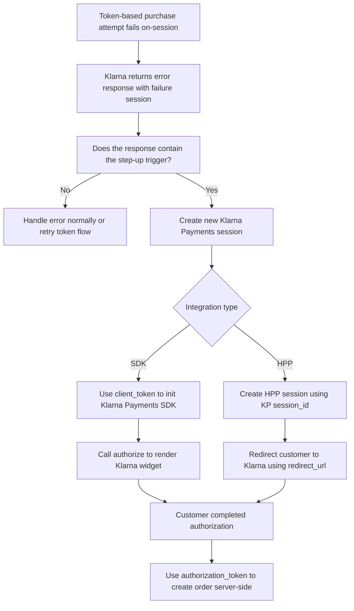

# Recover Token Charge Failure

Handle token order failures effectively by initiating a new Klarna session without the token, allowing
customers to restart the purchase journey and complete the transaction.

## Recovery Flow Overview

This article explains the recovery process to handle failures when placing an order using a customer token in
Klarna’s tokenized payment setup.

**\[WARNING]**

This recovery flow is designed for when the \*\*customer is present\*\* as this flow requires customer
interaction to be successful.

If a create order attempt using a customer token fails, Klarna returns an error informing that the customer
token can’t be used to complete the transaction.

In case of a customer being present in the session, the partner should fallback to creating a
[new payment session](https://docs.klarna.com/acquirer/klarna/web-payments/integrate-with-klarna-payments/integrate-via-sdk/step-1-initiate-a-payment/).
This allows the customer to enter the purchase flow and correct the issue(s) causing the token charge to fail.

If the recovery order is successful, the customer token will be updated with the chosen payment option for
future purchases.

### Recovery Flow Overview



### Server-side error based trigger

Monitor Klarna responses to the
[create order from a customer token](https://docs.klarna.com/api/customertoken/#operation/createOrder) API
call. It is always recommended to attempt a fallback purchase flow if you receive an error code in the
response and the customer is present.

Consult
[this page](https://docs.klarna.com/acquirer/klarna/web-payments/additional-resources/error-handling-and-validations/validations-in-kp/)
for a complete list of validations during the payment process.

## Recovery Implementation Guidelines

Klarna can be integrated into your website in two different ways, depending on your setup and preferred level
of customization. Each option has its own implementation steps and requirements:

- **[Klarna Payment SDK](https://docs.klarna.com/payments/web-payments/integrate-with-klarna-payments/tokenized-payments/recover-charge-failure/#recovery-implementation-guidelines-klarna-payment-sdk-integration)**
- **[Hosted Payment Page (HPP)](https://docs.klarna.com/payments/web-payments/integrate-with-klarna-payments/tokenized-payments/recover-charge-failure/#recovery-implementation-guidelines-hosted-payment-page-integration)**

Follow the instructions that correspond to the integration method you've chosen to ensure a smooth and
reliable setup.

### Klarna Payment SDK integration

For a complete overview of Klarna Payment SDK based Integration, see the detailed documentation
[here](https://docs.klarna.com/acquirer/klarna/web-payments/integrate-with-klarna-payments/integrate-via-sdk/how-to-integrate-klarna-payments/).

**\[INFO]**

\[Klarna Payment SDK must be
added]\(https\://docs.klarna.com/acquirer/klarna/web-payments/integrate-with-klarna-payments/integrate-via-sdk/step-2-checkout/#set-up-klarna.27s-javascript-sdk)
to any page where the fallback purchase flow may be required.

#### Step 1: Create an order using customer token

Use Klarna’s
[create order using customer token endpoint](https://docs.klarna.com/api/customertoken/#operation/createOrder)
to charge an already generated customer token. The `step_up` should be set to SUPPORTED in case of customer
being present and recovery flow can be triggered. `step_up` would default to `NOT_SUPPORTED` in case of
missing. When `step_up` is set to `SUPPORTED` and the create order being rejected, a `step_up_id` will be
returned in the response and should be provided in the following step-up session.

**_Sample request_**

```json
{
  "purchase_currency": "USD",
  "auto_capture": true,
  "order_amount": 9500,
  "order_tax_amount": 1900,
  "order_lines": [
    {
      "type": "physical",
      "reference": "19-402",
      "name": "Battery Power Pack",
      "quantity": 1,
      "unit_price": 10000,
      "tax_rate": 2500,
      "total_amount": 9500,
      "total_discount_amount": 500,
      "total_tax_amount": 1900,
      "image_url": "https://www.exampleobjects.com/logo.png",
      "product_url": "https://www.estore.com/products/f2a8d7e34"
    }
  ],
  "merchant_urls": {
    "authorization": "https://example.com/authorization_callbacks"
  },
  "merchant_reference1": "45aa52f387871e3a210645d4",
  "step_up": "SUPPORTED"
}
```

**_Sample response_**

```json
{
  "correlation_id": "bcd1cd0d-f122-42a9-95ac-a4c106c13c3a",
  "error_code": "UNAVAILABLE_PAYMENT_METHOD",
  "error_messages": ["Purchase for payment method failed"],
  "fraud_status": "REJECTED",
  "reason": "Purchase for payment method failed",
  "authorized_payment_method": {
    "type": "card"
  },
  "step_up_id": "06826d76-c2f4-4378-b586-2751e6f84adf"
}
```

#### Step 2: Create a new Klarna session

Use Klarna’s [create session endpoint](https://docs.klarna.com/api/payments/#operation/createCreditSession) to
create a
[new session](https://docs.klarna.com/acquirer/klarna/web-payments/integrate-with-klarna-payments/integrate-via-sdk/step-1-initiate-a-payment/#payment-scenarios-and-intent).
The `intent` should reflect the `intent` provided in original session created. The `customer_token` from the
failed charge must be provided as part of the `customer` object. The `step_up_id` from the failed charge must
be provided for Klarna to later update the stored payment option on the `customer_token`.

**_Sample request_**

```json
{
  "acquiring_channel": "ECOMMERCE",
  "intent": "buy_and_tokenize",
  "step_up_id": "<failed_charge_response.step_up_id>",
  "customer": {
    "customer_token": "<customer_token>"
  },
  "purchase_country": "US",
  "purchase_currency": "USD",
  "locale": "en-US",
  "order_amount": 9500,
  "order_tax_amount": 1900,
  "order_lines": [
    {
      "type": "physical",
      "reference": "19-402",
      "name": "Battery Power Pack",
      "quantity": 1,
      "unit_price": 10000,
      "tax_rate": 2500,
      "total_amount": 9500,
      "total_discount_amount": 500,
      "total_tax_amount": 1900,
      "image_url": "https://www.exampleobjects.com/logo.png",
      "product_url": "https://www.estore.com/products/f2a8d7e34"
    }
  ],
  "merchant_urls": {
    "authorization": "https://example.com/authorization_callbacks"
  },
  "merchant_reference1": "45aa52f387871e3a210645d4"
}
```

**_Sample response_**

```json
{
  "session_id": "068df369-13a7-4d47-a564-62f8408bb760",
  "client_token": "<client_token>",
  "payment_method_categories": [
    {
      "identifier": "klarna",
      "name": "Pay with Klarna",
      "asset_urls": {
        "descriptive": "https://x.klarnacdn.net/payment-method/assets/badges/generic/klarna.svg",
        "standard": "https://x.klarnacdn.net/payment-method/assets/badges/generic/klarna.svg"
      }
    }
  ]
}
```

Store the `client_token` from the response for the following steps.

#### Step 3: Initialize **the Klarna widget and authorize the purchase**

Using the `client_token` from the session response and initialize the Klarna modal. You can immediately
trigger the Klarna Purchase Flow by calling `authorize()` via the
[JavaScript SDK](https://docs.klarna.com/payments/web-payments/integrate-with-klarna-payments/integrate-via-sdk/step-2-checkout/#get-authorization).

**_Sample request_**

```javascript
Klarna.Payments.init({
  client_token: '<client_token>'
})

Klarna.Payments.authorize(
  {},
  {
    shipping_address: {
      given_name: 'John',
      family_name: 'Doe',
      email: 'john@doe.com',
      title: 'Mr',
      street_address: 'Lombard St 10',
      street_address2: 'Apt 214',
      postal_code: '90210',
      city: 'Beverly Hills',
      region: 'CA',
      phone: '333444555',
      country: 'US'
    }
  },
  function (res) {
    console.debug(res)
  }
)
```

There are two ways to retrieve the `authorization_token`:

- **Client-side:** Returned as part of the `authorize()` call.
- **Server-side:** Provided through an
  [authorization callback url](https://docs.klarna.com/acquirer/klarna/web-payments/integrate-with-klarna-payments/other-actions/authorization-callback/)
  configured in the `create_session` call.

**\[WARNING]**

If the customer is declined at this stage, redirect them back to the checkout to select a different payment
method.

#### Step 4: Create the order using authorization token

For a successfully authorized purchase you can use the returned `authorization_token` to
[create the order](https://docs.klarna.com/payments/web-payments/integrate-with-klarna-payments/step-3-create-an-order/):

##### Path parameter

| Parameter name                                                                                                                | Description                                                                         |
| ----------------------------------------------------------------------------------------------------------------------------- | ----------------------------------------------------------------------------------- |
| `[authorizationToken](https://docs.klarna.com/api/payments/#operation/createOrder!in=path&path=authorizationToken&t=request)` | Token issued by Klarna that represents a consumer's approval for a payment session. |

**_Sample request_**

```json
{
  "purchase_country": "US",
  "purchase_currency": "USD",
  "locale": "en-US"
  "shipping_address": {
    "given_name": "John",
    "family_name": "Doe",
    "email": "john@doe.com",
    "title": "Mr",
    "street_address": "Lombard St 10",
    "street_address2": "Apt 214",
    "postal_code": "90210",
    "city": "Beverly Hills",
    "region": "CA",
    "phone": "333444555",
    "country": "US"
  },
  "order_amount": 9500,
  "order_tax_amount": 1900,
  "order_lines": [
    {
      "type": "physical",
      "reference": "19-402",
      "name": "Battery Power Pack",
      "quantity": 1,
      "unit_price": 10000,
      "tax_rate": 2500,
      "total_amount": 9500,
      "total_discount_amount": 500,
      "total_tax_amount": 1900,
      "image_url": "https://www.exampleobjects.com/logo.png",
      "product_url": "https://www.estore.com/products/f2a8d7e34"
    }
  ],
  "merchant_urls": {
    "authorization": "https://example.com/authorization_callbacks"
  }
  "merchant_reference1": "45aa52f387871e3a210645d4",
}

```

**_Sample response_**

```json
{
  "order_id": "3eaeb557-5e30-47f8-b840-b8d987f5945d",
  "redirect_url": "https://payments.klarna.com/redirect/...",
  "fraud_status": "ACCEPTED",
  "authorized_payment_method": "invoice"
}
```

**\[WARNING]**

Once a purchase is successfully created, it will be automatically linked to the existing customer token, and
the same token can then used to charge future purchases.

### **Hosted Payment Page integration**

For a complete overview of Klarna’s Hosted Payment Page integration, see the detailed documentation
[here](https://docs.klarna.com/acquirer/klarna/web-payments/integrate-with-klarna-payments/integrate-via-hpp/before-you-start/).

#### Step 1: Create an order using customer token

Use Klarna’s
[create order using customer token endpoint](https://docs.klarna.com/api/customertoken/#operation/createOrder)
to charge an already generated customer token. The `step_up` should be set to SUPPORTED in case of customer
being present and recovery flow can be triggered. `step_up` would default to `NOT_SUPPORTED` in case of
missing. When `step_up` is set to `SUPPORTED` and the create order being rejected, a `step_up_id` will be
returned in the response and should be provided in the following step-up session.

**_Sample request_**

```json
{
  "purchase_currency": "USD",
  "auto_capture": true,
  "order_amount": 9500,
  "order_tax_amount": 1900,
  "order_lines": [
    {
      "type": "physical",
      "reference": "19-402",
      "name": "Battery Power Pack",
      "quantity": 1,
      "unit_price": 10000,
      "tax_rate": 2500,
      "total_amount": 9500,
      "total_discount_amount": 500,
      "total_tax_amount": 1900,
      "image_url": "https://www.exampleobjects.com/logo.png",
      "product_url": "https://www.estore.com/products/f2a8d7e34"
    }
  ],
  "merchant_urls": {
    "authorization": "https://example.com/authorization_callbacks"
  },
  "merchant_reference1": "45aa52f387871e3a210645d4",
  "step_up": "SUPPORTED"
}
```

**_Sample response_**

```json
{
  "correlation_id": "bcd1cd0d-f122-42a9-95ac-a4c106c13c3a",
  "error_code": "UNAVAILABLE_PAYMENT_METHOD",
  "error_messages": ["Purchase for payment method failed"],
  "fraud_status": "REJECTED",
  "reason": "Purchase for payment method failed",
  "authorized_payment_method": {
    "type": "card"
  },
  "step_up_id": "06826d76-c2f4-4378-b586-2751e6f84adf"
}
```

#### Step 2: Create a new one-time Klarna session

Use Klarna’s [create session endpoint](https://docs.klarna.com/api/payments/#operation/createCreditSession) to
create a
[new one-time-buy session](https://docs.klarna.com/acquirer/klarna/web-payments/integrate-with-klarna-payments/integrate-via-sdk/step-1-initiate-a-payment/#one-time-payment).
The `intent` should reflect intent provided in initial created session. The `customer_token` from the failed
charge must be provided as part of the `customer`. The `step_up_id` from the failed charge must be provided
for Klarna to later update the stored payment option on the `customer_token`.

**_Sample request_**

```json
{
  "acquiring_channel": "ECOMMERCE",
  "intent": "buy_and_tokenize",
  "step_up_id": "<failed_charge_response.step_up_id>",
  "customer": {
    "customer_token": "<customer_token>"
  }
  "purchase_country": "US",
  "purchase_currency": "USD",
  "locale": "en-US",
  "order_amount": 9500,
  "order_tax_amount": 1900,
  "order_lines": [
    {
      "type": "physical",
      "reference": "19-402",
      "name": "Battery Power Pack",
      "quantity": 1,
      "unit_price": 10000,
      "tax_rate": 2500,
      "total_amount": 9500,
      "total_discount_amount": 500,
      "total_tax_amount": 1900,
      "image_url": "https://www.exampleobjects.com/logo.png",
      "product_url": "https://www.estore.com/products/f2a8d7e34"
    }
  ],
  "merchant_urls": {
    "authorization": "https://example.com/authorization_callbacks"
  }
  "merchant_reference1": "45aa52f387871e3a210645d4",
}

```

**_Sample response_**

```json
{
  "session_id": "068df369-13a7-4d47-a564-62f8408bb760",
  "client_token": "<client_token>",
  "payment_method_categories": [
    {
      "identifier": "klarna",
      "name": "Pay with Klarna",
      "asset_urls": {
        "descriptive": "https://x.klarnacdn.net/payment-method/assets/badges/generic/klarna.svg",
        "standard": "https://x.klarnacdn.net/payment-method/assets/badges/generic/klarna.svg"
      }
    }
  ]
}
```

Store the `session_id` from the response.

#### Step 3: Create a Hosted Payment Page session

Associate the Klarna Payments `session_id` from the session response with the Hosted Payment Page session by
including it in the `payment_session_url` when creating the
[HPP session](https://docs.klarna.com/api/hpp-merchant/#operation/createHppSession).

| **Parameter**                                                                                                                      | **Presence** | **Description**                                                                                                                                                                                                       |
| ---------------------------------------------------------------------------------------------------------------------------------- | ------------ | --------------------------------------------------------------------------------------------------------------------------------------------------------------------------------------------------------------------- |
| `[payment_session_url](https://docs.klarna.com/api/hpp-merchant/#operation/createHppSession!path=payment_session_url&t=request)`   | required     | URL of the KP Session, obtained in the first step, to be hosted by the HPP Session.                                                                                                                                   |
| `[place_order_mode](https://docs.klarna.com/api/hpp-merchant/#operation/createHppSession!path=options/place_order_mode&t=request)` | optional     | It determines whether the place order operation is handled by the Hosted Payment Page or by your own system. Possible values are: \* `PLACE_ORDER` \* `CAPTURE_ORDER` \* `NONE` (used by default if no value is sent) |

**_Sample request_**

```json
{
  "merchant_urls": {
    "back": "https://example.com/back?sid=xxxxxxxx-xxxx-xxxx-xxxx-xxxxxxxxxxxx&hppId={{session_id}}",
    "cancel": "https://example.com/cancel?sid=xxxxxxxx-xxxx-xxxx-xxxx-xxxxxxxxxxxx&hppId={{session_id}}",
    "error": "https://example.com/error?sid=xxxxxxxx-xxxx-xxxx-xxxx-xxxxxxxxxxxx&hppId={{session_id}}",
    "failure": "https://example.com/fail?sid=xxxxxxxx-xxxx-xxxx-xxxx-xxxxxxxxxxxx&hppId={{session_id}}",
    "status_update": "https://example.com/status_update?sid=xxxxxxxx-xxxx-xxxx-xxxx-xxxxxxxxxxxx&secret=yyyyyyyy-yyyy-yyyy-yyyy-yyyyyyyyyyyy&hppId={{session_id}}",
    "success": "https://example.com/success?sid=xxxxxxxx-xxxx-xxxx-xxxx-xxxxxxxxxxxx&hppId={{session_id}}&token={{authorization_token}}"
  },
  "options": {
    "background_images": [
      {
        "url": "string",
        "width": 0
      }
    ],
    "logo_url": "https://example.com/logo.jpg",
    "page_title": "Complete your purchase",
    "place_order_mode": "PLACE_ORDER",
    "purchase_type": "BUY",
    "show_subtotal_detail": "HIDE"
  },
  "payment_session_url": "https://api.klarna.com/payments/v1/sessions/<session_id>",
  "profile_id": "87ab3565-5e06-4006-9ada-8eedc6926703"
}
```

**_Sample response_**

```json
{
  "distribution_module": {
    "generation_url": "string",
    "standalone_url": "string",
    "token": "string"
  },
  "distribution_url": "https://api.klarna.com/hpp/v1/sessions/9cbc9884-1fdb-45a8-9694-9340340d0436/distribution",
  "expires_at": "2038-01-19T03:14:07.000Z",
  "manual_identification_check_url": "https://api.klarna.com/hpp/v1/sessions/9cbc9884-1fdb-45a8-9694-9340340d0436/manual-id-check",
  "qr_code_url": "https://pay.klarna.com/eu/hpp/payments/a94e7760-d135-2721-a538-d6294ea254ed/qr",
  "redirect_url": "https://pay.klarna.com/eu/hpp/payments/2OCkffK",
  "session_id": "9cbc9884-1fdb-45a8-9694-9340340d0436",
  "session_url": "https://api.klarna.com/hpp/v1/sessions/9cbc9884-1fdb-45a8-9694-9340340d0436"
}
```

#### Step 4: Redirect customers to the Hosted Payment Page and Monitor the Authorization status

Redirect the customer to the Hosted Payment Page using the
`[redirect_url](https://docs.klarna.com/api/hpp-merchant/#operation/createHppSession!c=201&path=redirect_url&t=response)`
provided in the session creation response. You may optionally display a prompt or call-to-action before
initiating the redirect. To track the session status, either:

- **[Configure a Klarna webhook](https://docs.klarna.com/payments/web-payments/integrate-with-klarna-payments/integrate-via-hpp/before-you-start/tracking-session-status/#getting-the-hpp-session-updates-by-using-the-callback-mechanism)**
  to receive asynchronous updates.
- **[Poll Klarna’s API](https://docs.klarna.com/payments/web-payments/integrate-with-klarna-payments/integrate-via-hpp/before-you-start/tracking-session-status/#reading-the-hpp-session-updates-by-polling-an-endpoint)**
  to retrieve the result of the session. Refer to the
  [HPP session lifecycle](https://docs.klarna.com/payments/other-products/hosted-payment-page/before-you-start/accept-klarna-payments-using-hosted-payment-page/#hpp-session-lifecycle)
  for a detailed explanation of how the session progresses and how to handle its different states.

**\[WARNING]**

If the payment is declined, redirect the customer back to checkout so they can choose another payment method.

#### Step 5: Create the order using authorization token

**\[INFO]**

If the HPP session was created using \`PLACE_ORDER\` and \`CAPTURE_ORDER\` modes, Klarna handles the order
creation, and an \`order_id\` is returned, no further action is needed.

When the session was created using `place_order_mode: NONE`, Klarna does not create the order automatically.

Use the returned `authorization_token` returned upon successful authorization to
[create the order](https://docs.klarna.com/payments/web-payments/integrate-with-klarna-payments/step-3-create-an-order/):

##### Path parameter

| Parameter name                                                                                                                | Description                                                                         |
| ----------------------------------------------------------------------------------------------------------------------------- | ----------------------------------------------------------------------------------- |
| `[authorizationToken](https://docs.klarna.com/api/payments/#operation/createOrder!in=path&path=authorizationToken&t=request)` | Token issued by Klarna that represents a consumer's approval for a payment session. |

**_Sample request_**

```json
{
  "purchase_country": "US",
  "purchase_currency": "USD",
  "locale": "en-US",
  "order_amount": 9500,
  "order_tax_amount": 1900,
  "order_lines": [
    {
      "type": "physical",
      "reference": "19-402",
      "name": "Battery Power Pack",
      "quantity": 1,
      "unit_price": 10000,
      "tax_rate": 2500,
      "total_amount": 9500,
      "total_discount_amount": 500,
      "total_tax_amount": 1900,
      "image_url": "https://www.exampleobjects.com/logo.png",
      "product_url": "https://www.estore.com/products/f2a8d7e34"
    }
  ],
  "merchant_urls": {
    "authorization": "https://example.com/authorization_callbacks"
  }
  "merchant_reference1": "45aa52f387871e3a210645d4",
}

```

**_Sample response_**

```json
{
  "order_id": "3eaeb557-5e30-47f8-b840-b8d987f5945d",
  "redirect_url": "https://payments.klarna.com/redirect/...",
  "fraud_status": "ACCEPTED",
  "authorized_payment_method": "invoice"
}
```

**\[WARNING]**

Once a purchase is successfully created, it will be automatically linked to the existing customer token, and
the same token can then used to charge future purchases.
