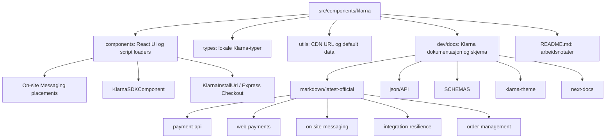

# Klarna sitemap for agents

Sist oppdatert: 2026-05-31. 

Kildegrunnlag: lokalt filsystem under `src/components/klarna`. Ingen ekstern dokumentasjon er hentet for denne oversikten. Markdown beholdes som filtype fordi den gir best kombinasjon av menneskelig lesbarhet, lenker, tabeller, kodeblokker og Mermaid-diagram for agentbruk.

## Rask orientering


| Område                          | Start her                                                                  | Hva agenten skal bruke det til                                                |
| ------------------------------- | -------------------------------------------------------------------------- | ----------------------------------------------------------------------------- |
| Implementerte React-komponenter | `[components/](components/)`                                               | Klarna placements, SDK-script og Express Checkout-knapp                       |
| Delt typing                     | `[types/index.ts](types/index.ts)`                                         | Lokale TypeScript-typer for placements og Express Checkout                    |
| Delte konstanter og data        | `[utils/](utils/)`                                                         | Klarna CDN URL og standard placement-data                                     |
| Lokale Klarna-notater           | `[README.md](README.md)`                                                   | Arbeidsnotater om conversion features og EMD                                  |
| Offisielle Markdown-notater     | `[dev/docs/markdown/latest-official/](dev/docs/markdown/latest-official/)` | Betaling, On-site Messaging, Express Checkout, Order Management og resilience |
| OpenAPI/JSON-skjema             | `[dev/docs/json/API/](dev/docs/json/API/)`                                 | API-kontrakter og EMD-skjema                                                  |
| Next.js-notater                 | `[dev/docs/next-docs/](dev/docs/next-docs/)`                               | Lokale notater om `next/script` og adaptere                                   |


## Mentalt kart




## Agentbeslutning

- Behold `klarna-sitemap.md` som Markdown. Ikke flytt til JSON/YAML fordi mennesker mister lesbarhet og agenter mister kontekst rundt hvorfor filene finnes.
- Bruk denne filen som navigasjonsindeks, ikke som sannhetskilde for API-formater.
- Ved API-implementering skal agenten lese relevante lokale docs og deretter hente oppdatert dokumentasjon via Context7 eller offisiell kilde hvis API-formen kan ha endret seg.
- Ved UI-endringer skal agenten sjekke eksisterende komponentmønster i `components/` for å unngå ny stil uten grunn.

## Implementerte filer


| Fil                                                                                                              | Eksport                                    | Ansvar                                                       | Viktige signaler                                                                                           |
| ---------------------------------------------------------------------------------------------------------------- | ------------------------------------------ | ------------------------------------------------------------ | ---------------------------------------------------------------------------------------------------------- |
| `[components/KlarnaSDKComponent.tsx](components/KlarnaSDKComponent.tsx)`                                         | `KlarnaSDKComponent`                       | Laster `https://cdn.klarna.com/1.0/sdk.js` via `next/script` | Client component, `strategy="beforeInteractive"`                                                           |
| `[components/KlarnaAsyncCallbackWrapperComponent.tsx](components/KlarnaAsyncCallbackWrapperComponent.tsx)`       | `KlarnaInstallUrl`                         | Express Checkout loader med `orderPayload`                   | Bruker `KLARNA_CDN_API_URL`, `NEXT_PUBLIC_KLARNA_CLIENT_ID`, container `klarna-express-checkout-container` |
| `[utils/KlarnaInstallUrl.tsx](utils/KlarnaInstallUrl.tsx)`                                                       | `KlarnaInstallUrl`                         | Alternativ Express Checkout loader                           | Overlapper funksjonsnavn med komponentfilen; sjekk importvei for du endrer                                 |
| `[components/KlarnaCreditPromotionAutoSize.tsx](components/KlarnaCreditPromotionAutoSize.tsx)`                   | `KlarnaCreditPromotionAutoSize`            | OSM placement                                                | `data-key="credit-promotion-auto-size"`, `data-locale="no-NO"`                                             |
| `[components/KlarnaCreditPromotionBadge.tsx](components/KlarnaCreditPromotionBadge.tsx)`                         | `KlarnaCreditPromotionBadge`               | OSM placement                                                | `data-key="credit-promotion-badge"`, `data-locale="no-NO"`                                                 |
| `[components/KlarnaFooterPromotionAutoSize.tsx](components/KlarnaFooterPromotionAutoSize.tsx)`                   | `KlarnaFooterPromotionAutoSize`            | OSM footer placement                                         | `data-key="footer-promotion-auto-size"`, dark theme                                                        |
| `[components/KlarnaHomePagePromotionBox.tsx](components/KlarnaHomePagePromotionBox.tsx)`                         | `KlarnaHomePagePromotionBox`               | OSM homepage box                                             | `data-key="homepage-promotion-box"`, dark theme                                                            |
| `[components/KlarnaHomePagePromotionTall.tsx](components/KlarnaHomePagePromotionTall.tsx)`                       | `KlarnaHomePagePromotionTall`              | OSM homepage tall                                            | `data-key="homepage-promotion-tall"`, dark theme                                                           |
| `[components/KlarnaHomePagePromotionWideComponent.tsx](components/KlarnaHomePagePromotionWideComponent.tsx)`     | `KlarnaHomePagePromotionWide`              | OSM homepage wide                                            | `data-key="homepage-promotion-wide"`, dark theme                                                           |
| `[components/KlarnaInfoPagePlacementComponent.tsx](components/KlarnaInfoPagePlacementComponent.tsx)`             | `KlarnaInfoPagePlacement`                  | OSM info page placement                                      | `data-key="info-page"`, dark theme                                                                         |
| `[components/KlarnaSidebarPromotionSidebarComponent.tsx](components/KlarnaSidebarPromotionSidebarComponent.tsx)` | `KlarnaSidebarPromotionSidebarComponent`   | OSM sidebar placement                                        | `data-key="sidebar-promotion-auto-size"`, dark theme                                                       |
| `[components/KlarnaTopStripPromotionAutoSize.tsx](components/KlarnaTopStripPromotionAutoSize.tsx)`               | `KlarnaTopStripPromotionAutoSize`          | OSM top strip auto size                                      | `data-key="top-strip-promotion-auto-size"`, dark theme                                                     |
| `[components/KlarnaTopStripPromotionBadge.tsx](components/KlarnaTopStripPromotionBadge.tsx)`                     | `KlarnaTopStripBadge`                      | OSM top strip badge                                          | `data-key="top-strip-promotion-badge"`, `data-locale="no-NO"`                                              |
| `[types/index.ts](types/index.ts)`                                                                               | Klarna placement og Express Checkout-typer | Delt kontrakt for lokale komponenter                         | Ikke Zod-validering; kun TypeScript-typer                                                                  |
| `[utils/data.ts](utils/data.ts)`                                                                                 | `DEFAULT_KLARNA_PLACEMENT_DATA`            | Standard placement-data                                      | Default key: `credit-promotion-badge`                                                                      |
| `[utils/klarnaCdnApiUrl.ts](utils/klarnaCdnApiUrl.ts)`                                                           | `KLARNA_CDN_API_URL`                       | CDN URL-konstant                                             | `https://x.klarnacdn.net/kp/lib/v1/api.js`                                                                 |


## Arbeidsflyt for agenter


| Oppgave                      | Les først                                                                                                                | Les deretter                                                                                                                                                                                 | Ikke gjør                                                           |
| ---------------------------- | ------------------------------------------------------------------------------------------------------------------------ | -------------------------------------------------------------------------------------------------------------------------------------------------------------------------------------------- | ------------------------------------------------------------------- |
| Endre OSM placement          | Relevant fil i `[components/](components/)`                                                                              | `[dev/docs/markdown/latest-official/on-site-messaging/](dev/docs/markdown/latest-official/on-site-messaging/)`                                                                               | Ikke hardkod nye `data-key` uten å sjekke docs                      |
| Endre Express Checkout-knapp | `[components/KlarnaAsyncCallbackWrapperComponent.tsx](components/KlarnaAsyncCallbackWrapperComponent.tsx)`               | `[dev/docs/klarna-theme/](dev/docs/klarna-theme/)` og `[dev/docs/markdown/latest-official/web-payments/express-checkout/](dev/docs/markdown/latest-official/web-payments/express-checkout/)` | Ikke anta SDK-signatur uten oppdatert docs                          |
| Endre betalingspayload       | `[types/index.ts](types/index.ts)`                                                                                       | `[dev/docs/json/API/Klarna-Payments-API.json](dev/docs/json/API/Klarna-Payments-API.json)`                                                                                                   | Ikke bruk bare `Record<string, unknown>` i ny validering            |
| Legge til EMD                | `[dev/docs/json/API/Extra-Merchant-Data-EMD/README.md](dev/docs/json/API/Extra-Merchant-Data-EMD/README.md)`             | `[dev/docs/json/API/Extra-Merchant-Data-EMD/how-to-send-emd.md](dev/docs/json/API/Extra-Merchant-Data-EMD/how-to-send-emd.md)`                                                               | Ikke send EMD uten schema-validering                                |
| Feilhandtering               | `[dev/docs/markdown/latest-official/integration-resilience/](dev/docs/markdown/latest-official/integration-resilience/)` | Relevante API JSON-filer                                                                                                                                                                     | Ikke swallow SDK/API-feil uten auditbar logging                     |
| Order Management             | `[dev/docs/markdown/latest-official/order-management/](dev/docs/markdown/latest-official/order-management/)`             | `[dev/docs/json/API/Order-Management-API.json](dev/docs/json/API/Order-Management-API.json)`                                                                                                 | Ikke endre capture/refund-flyt uten konsistenssjekk for order lines |


## Fullt filetree

Ignorer `.DS_Store`; de er lokale macOS-metadatafiler og ikke relevante for agenter.

```text
src/components/klarna
├── README.md
├── klarna-sitemap.md
├── components
│   ├── KlarnaAsyncCallbackWrapperComponent.tsx
│   ├── KlarnaCreditPromotionAutoSize.tsx
│   ├── KlarnaCreditPromotionBadge.tsx
│   ├── KlarnaFooterPromotionAutoSize.tsx
│   ├── KlarnaHomePagePromotionBox.tsx
│   ├── KlarnaHomePagePromotionTall.tsx
│   ├── KlarnaHomePagePromotionWideComponent.tsx
│   ├── KlarnaInfoPagePlacementComponent.tsx
│   ├── KlarnaSDKComponent.tsx
│   ├── KlarnaSidebarPromotionSidebarComponent.tsx
│   ├── KlarnaTopStripPromotionAutoSize.tsx
│   └── KlarnaTopStripPromotionBadge.tsx
├── types
│   └── index.ts
├── utils
│   ├── KlarnaInstallUrl.tsx
│   ├── data.ts
│   └── klarnaCdnApiUrl.ts
└── dev
    ├── docs
    │   ├── general-best-practises.md
    │   ├── klarna-theme
    │   │   ├── button-placement.md
    │   │   └── button-styles.md
    │   ├── next-docs
    │   │   ├── Adapters.md
    │   │   └── ScriptComponent.md
    │   ├── SCHEMAS
    │   │   ├── PAYMENT-SCHEMA
    │   │   │   └── acquiring_channel
    │   │   │       ├── attachment.json
    │   │   │       └── billing_adress.json
    │   │   └── PaymentApiV3
    │   │       ├── address.json
    │   │       └── asset_urls.json
    │   ├── json
    │   │   └── API
    │   │       ├── Customer-Token-Api.json
    │   │       ├── Hosted-Payment-Page-API.json
    │   │       ├── Klarna-Payments-API.json
    │   │       ├── Merchant-Card-Service-API.json
    │   │       ├── Order-Management-API.json
    │   │       ├── Settlement-API.json
    │   │       └── Extra-Merchant-Data-EMD
    │   │           ├── README.md
    │   │           ├── how-to-send-emd.md
    │   │           └── json
    │   │               ├── customer_account_info.json
    │   │               ├── customer_tokens.json
    │   │               ├── extra_merchant_data_schema.json
    │   │               ├── marketplace_seller_info.json
    │   │               └── other_delivery_address.json
    │   └── markdown
    │       ├── legal
    │       │   └── regulated-financing-promotion-rules-for-Norway.md
    │       ├── web-payments
    │       │   └── additional-resources
    │       │       └── error-handling-and-validations
    │       │           └── validations-in-kp.md
    │       └── latest-official
    │           ├── apple
    │           │   └── documentation
    │           │       └── authenticationservices
    │           │           └── ASWebAuthenticationPresentationContextProviding.md
    │           ├── boost-features
    │           │   ├── go-live-list.md
    │           │   ├── integrate-with-mcs.md
    │           │   ├── terms-and-conditions.md
    │           │   └── vilkar-betingelser-klarna-url.md
    │           ├── integration-resilience
    │           │   ├── error-codes-and-messages.md
    │           │   ├── escalation-and-retry-policy.md
    │           │   ├── klarna-payment-sdk-reference.md
    │           │   └── tax-handling.md
    │           ├── kustom-api
    │           │   ├── acknowledge-a-kustom-checkout-order.md
    │           │   ├── api-updates.md
    │           │   ├── api-url.md
    │           │   ├── create-an-HPP-session.md
    │           │   ├── create-an-order-with-customer-token.md
    │           │   ├── get-details-of-an-HPP-session.md
    │           │   ├── metadata.md
    │           │   ├── open-api
    │           │   │   └── get_client.md
    │           │   └── orders
    │           │       └── updateauthorization.md
    │           ├── mobile-sdk-integration
    │           │   ├── ios.md
    │           │   └── overview-mobile-integration.md
    │           ├── on-site-messaging
    │           │   ├── migration-to-the-new-klarna-websdk.md.md
    │           │   ├── on-site-messaging-javascript-library.md
    │           │   ├── osm-exposed-events.md
    │           │   ├── product-and-cart-placements.md
    │           │   └── styling-on-site-messaging-with-css.md
    │           ├── order-management
    │           │   ├── capture-order.md
    │           │   └── what-is-order-management.md
    │           ├── payment-api
    │           │   ├── Initiate-a-payment.md
    │           │   ├── README.md
    │           │   └── get-details-about-a-session.md
    │           ├── sign-in-with-klarna
    │           │   ├── other-operations.md
    │           │   ├── mobile-sdk-integration
    │           │   │   ├── key-principles.md
    │           │   │   ├── mobile-sdk-integration.md
    │           │   │   └── system-provided-button.md
    │           │   └── web-sdk-integration
    │           │       ├── CustomerIdentityCloud.md
    │           │       ├── IdentityAPI.ts
    │           │       └── introduction-web-sdk-sign-in.md
    │           └── web-payments
    │               ├── additional-resources
    │               │   ├── klarna-payments-sdk-reference.md
    │               │   ├── payment-methods-availability.md
    │               │   └── use-cases
    │               │       ├── auto-capture.md
    │               │       ├── discount-voucher-or-code.md
    │               │       └── shipping-fees.md
    │               ├── express-checkout
    │               │   ├── README.md
    │               │   ├── checkout-installation.md
    │               │   ├── multi-step-checkout
    │               │   │   └── muliti-step-checkout-overview.md
    │               │   └── one-step-checkout
    │               │       └── one-step-checkout-overview.md
    │               ├── klarna-payments-SDK-reference
    │               │   └── README.md
    │               └── klarna-payments-integration
    │                   ├── STEPS
    │                   │   ├── STEP-ONE
    │                   │   │   └── initiate-a-payment.md
    │                   │   ├── STEP-TWO
    │                   │   │   └── check-out.md
    │                   │   └── STEP-THREE
    │                   │       └── one-time payment order.md
    │                   ├── operations
    │                   │   ├── authorize-call.md
    │                   │   ├── cancel-a-customer-token.md
    │                   │   ├── check-the-details-of-a-customer-token.md
    │                   │   ├── create-order-operation.md
    │                   │   ├── generate-a-customer-token.md
    │                   │   ├── get-details-about-session.md
    │                   │   ├── update-customer-token-status.md
    │                   │   ├── update-session.md
    │                   │   └── updating-cart-before-authorization.md
    │                   └── references
    │                       ├── authorization-callback.md
    │                       ├── cancel-an-authorization.md
    │                       ├── cancelAuthorization.md
    │                       └── escalation-and-retry-policy.md
    └── markdown
        └── integrate-with-klarna-payments
            └── tokenized-payments
                └── recover-charge-failure.md
```

## Dokumentkart


| Tema                                   | Lokale filer                                                                                                                                                                                                                                                                                                                                                   |
| -------------------------------------- | -------------------------------------------------------------------------------------------------------------------------------------------------------------------------------------------------------------------------------------------------------------------------------------------------------------------------------------------------------------- |
| Express Checkout plassering og styling | `[dev/docs/klarna-theme/button-placement.md](dev/docs/klarna-theme/button-placement.md)`, `[dev/docs/klarna-theme/button-styles.md](dev/docs/klarna-theme/button-styles.md)`, `[dev/docs/markdown/latest-official/web-payments/express-checkout/README.md](dev/docs/markdown/latest-official/web-payments/express-checkout/README.md)`                         |
| Klarna Payments API                    | `[dev/docs/json/API/Klarna-Payments-API.json](dev/docs/json/API/Klarna-Payments-API.json)`, `[dev/docs/markdown/latest-official/payment-api/README.md](dev/docs/markdown/latest-official/payment-api/README.md)`, `[dev/docs/markdown/latest-official/payment-api/Initiate-a-payment.md](dev/docs/markdown/latest-official/payment-api/Initiate-a-payment.md)` |
| Payment integration steg               | `[dev/docs/markdown/latest-official/web-payments/klarna-payments-integration/STEPS/](dev/docs/markdown/latest-official/web-payments/klarna-payments-integration/STEPS/)`                                                                                                                                                                                       |
| Payment operations                     | `[dev/docs/markdown/latest-official/web-payments/klarna-payments-integration/operations/](dev/docs/markdown/latest-official/web-payments/klarna-payments-integration/operations/)`                                                                                                                                                                             |
| Authorization references               | `[dev/docs/markdown/latest-official/web-payments/klarna-payments-integration/references/](dev/docs/markdown/latest-official/web-payments/klarna-payments-integration/references/)`                                                                                                                                                                             |
| On-site Messaging                      | `[dev/docs/markdown/latest-official/on-site-messaging/](dev/docs/markdown/latest-official/on-site-messaging/)`                                                                                                                                                                                                                                                 |
| Order Management                       | `[dev/docs/json/API/Order-Management-API.json](dev/docs/json/API/Order-Management-API.json)`, `[dev/docs/markdown/latest-official/order-management/](dev/docs/markdown/latest-official/order-management/)`                                                                                                                                                     |
| Extra Merchant Data                    | `[dev/docs/json/API/Extra-Merchant-Data-EMD/](dev/docs/json/API/Extra-Merchant-Data-EMD/)`                                                                                                                                                                                                                                                                     |
| Resilience og retry                    | `[dev/docs/markdown/latest-official/integration-resilience/](dev/docs/markdown/latest-official/integration-resilience/)`                                                                                                                                                                                                                                       |
| Norge-regler                           | `[dev/docs/markdown/legal/regulated-financing-promotion-rules-for-Norway.md](dev/docs/markdown/legal/regulated-financing-promotion-rules-for-Norway.md)`                                                                                                                                                                                                       |


## Kjente oppmerksomhetspunkter


| Punkt                                          | Hvor                                                                                                                                                                   | Hvorfor det betyr noe                                                                               |
| ---------------------------------------------- | ---------------------------------------------------------------------------------------------------------------------------------------------------------------------- | --------------------------------------------------------------------------------------------------- |
| To filer eksporterer `KlarnaInstallUrl`        | `[components/KlarnaAsyncCallbackWrapperComponent.tsx](components/KlarnaAsyncCallbackWrapperComponent.tsx)`, `[utils/KlarnaInstallUrl.tsx](utils/KlarnaInstallUrl.tsx)` | Kan skape importforvirring. Sjekk faktisk importbruk for refaktor.                                  |
| Express Checkout locale er `es-ES` i wrapper   | `[components/KlarnaAsyncCallbackWrapperComponent.tsx](components/KlarnaAsyncCallbackWrapperComponent.tsx)`                                                             | Resten av placement-komponentene bruker `no-NO`; sannsynligvis verdt å validere for norsk checkout. |
| Flere komponenter har TODO om typing           | Flere filer i `[components/](components/)`                                                                                                                             | Ved videre arbeid bør global JSX-typing for `klarna-placement` og Klarna SDK avklares.              |
| `src/components/klarna/sitemap.md` finnes ikke | Filsystemet                                                                                                                                                            | IDE-fanen kan vise en ikke-lagret eller tidligere fil. Denne filen er den faktiske sitemapen.       |
| API payload er `Record<string, unknown>`       | `[types/index.ts](types/index.ts)`                                                                                                                                     | Nye agent- eller checkout-flyter bør bruke Zod for runtime-validering.                              |


## Minimal agentoppskrift

1. Identifiser oppgaven i tabellen "Arbeidsflyt for agenter".
2. Les den konkrete implementeringsfilen.
3. Les bare relevante lokale Klarna-docs fra "Dokumentkart".
4. Hvis oppgaven endrer API-, SDK-, Next.js- eller betalingslogikk: hent oppdatert dokumentasjon for nøyaktig API-form for du implementerer.
5. Implementer smalt, med Zod-validering for alle nye payloads eller tool-schemas.
6. Test importstier og bygg/TypeScript etter endring.

